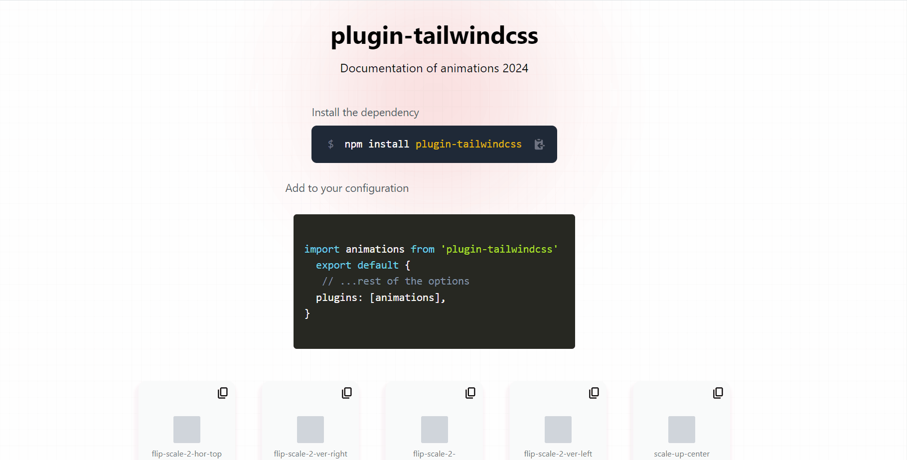

<div align="center">
  
</div>

# Animaciones CSS con tailwindcss

Este repositorio contiene dos proyectos uno seria el plugin de tailwindcss para animaciones y el otro seria un proyecto de documentacion del plugin. El proyecto busca poder implementar una series diferentes de animaciones que se pueden usar en cualquier proyecto que se este trabajando con tailwindcss.

Se esta usando lerna para poder manejar los dos proyectos en un mismo repositorio.

## Instalación

Para poder instalar el plugin de animaciones de tailwindcss podemos hacer un enlace local con el siguiente comando:

```bash
npm link ./packages/modcssline-plugin -w ./packages/docs-web 
```

Instalamos las dependencias de los proyectos con el siguiente comando:

```bash
npm install
```

Si queremos instalar las dependencias de un proyecto en especifico podemos hacerlo con el siguiente comando:

```bash
npm install -w packages/<nombre-del-proyecto>
```

## Uso

Para poder usar el plugin de animaciones de tailwindcss en un proyecto podemos hacerlo de la siguiente manera en el archivo de configuración de tailwindcss:

```javascript
import plugin from "plugin-tailwindcss";
export default {
  plugins: [
    plugin,
  ],
}
```

Para poder ver la documentación del plugin de animaciones de tailwindcss podemos hacerlo con el siguiente comando:

```bash
npm run dev
```

## Web documentación


